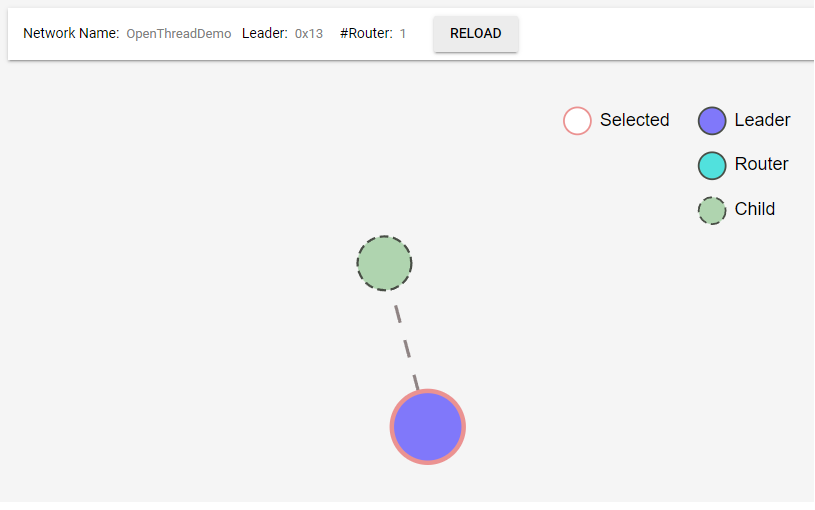
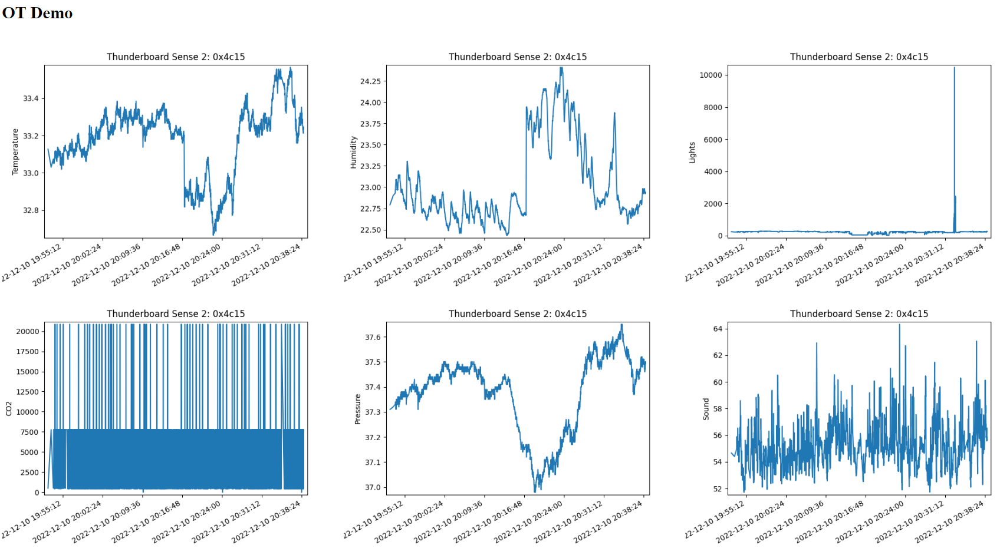

# OpenThread Demo

This is a basic OpenThread diagnostic system. The OT end devices, are Thunderboard Sense 2 boards, having numerous sensors to measure it's environment. 
The Thunderboards firmware can be found under firmware/
### Topology of the demo

## Utilities
A simple python script was made to observe the traffic coming from the end devices, and saving the measured values to a csv file.
The python script creates plots using matplotlib.

There's also a simple webserver application made using node.js, which make these plots accessible through a web interface.

### Webserver view

